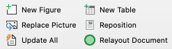

# Microsoft Word Plug-in to Lay Out Images and Tables as a Desktop Publisher

 
New, wonderful, support towards desktop publishing in Microsoft Word: beautiful layout of floating images and tables!

Click [here](#installation) to skip to the installation instructions and [here](#instructions) for the usage instructions.

 This plug-in improves Microsoft Word, making it much easier to work with floating images, floating tables and the references to them. On its own, Microsoft Word is poor at positioning images and tables. You have to position images manually; captions don't work very well; and when you add text or change anything, everything ends up in a mess. But it doesn't have to be like that. Other word processing packages are rather good at positioning images and tables: LaTeX users point with pride at its clever image positioning; FrameMaker flows everything around pictures; InDesign and QuarkExpress do wonders! Yet Microsoft Word is programmable, so why not make Word do the same?

This add-in does just that. It makes it easy to insert pictures and tables within frames, and can lay out all those frames in your document in a pleasing way so that each frame is as close as possible to the main reference to it, without being constrained to be on the same page.

The plug-in also addresses two limitations of Word:

*  **Preserving image size and cropping**: If you have an graphic-creating tool that doesn't support Word embedding (and there are lots nowadays), then you have to save the graphic as a PNG, JPEG, SVG, or (on a Mac) PDF, import it into Word as a picture, then crop and size it to suit your needs. That's easy enough. But when you make changes to the graphic, Word's 'Change Picture' function forgets the size and cropping you've so carefully set up, so you have to crop and size it again: every time! The **Replace Picture** function solves that problem by remembering the size and crop for the picture (and its border settings too). It makes changing external graphics as easy as object embedding!

* **Updating**: Word doesn't update its fields consistently, especially cross references. Only when you print does it update the fields, so only then do you see the errors from lost field references (and even then with some fields you may need to print twice!). The **Update All** function solves that problem by fully updating every field.

The plug-in works on the latest (2021) Microsoft Office installations: Word for Windows version 16, and Word for Mac version 16. It does not support Word 365 online, since that doesn't support VBA (or floating images and tables, either).

## <a name="instructions"/> The Functions (and When to Use Them)

The plug-in creates six new buttons in the *Layout* tab:

**New Figure**: creates a new figure in a frame with a figure caption, plus a reference to it at the insertion point. It uses a placeholder figure; use the **Replace Picture** button to chose another, and edit the caption accordingly. You can resize the image and the frame will expand or contract to fit. The frame starts at the top of the page; use the **Reposition** button to move the frame around, or **Relayout Document** to rearrange all the frames. In two-column mode, **New Figure** fits the figure to a single column; to make a double-width figure, select the frame and drag a corner to make it bigger than a column, then click **Reposition** to expand it to the full width.

**New Table**: creates a new table in a frame with a caption, plus a reference to it at the insertion point. Replace the table with what you want. The frame starts at the bottom of the page; again, use  **Reposition** or **Relayout Document** to move it around.

**Replace Picture**: does the same as Word's **Change Picture** button, but keeps the same size and cropping. Select an image before use. 

**Reposition**: moves a frame around the page consistently with the LaTeX formatting rules. So big frames go at the top or bottom of the page; small frames in a two-column page go at the top or bottom of a column; small frames in a single-column page go to the left or right of the text. Clicking the button twice moves the frame to another position: top vs bottom, or left vs right. The operation doesn't move the frame's anchor, so the frame always stays on the same page. Just select a frame and try it!

**Update All**: Updates all the fields in the document, reliably. To check for cross referencing errors, search for "Error!" and " 0" afterwards.

**Relayout Document** <a name="relayoutDocument"/> is the most complex of the functions here. It looks through the current document for all the frames with references to them (as created by **New Figure** and **New Table**), checks that you want to go ahead, then arranges the frames at the top and bottom of columns and pages, each as close as possible to its reference, according to the LaTeX formatting rules. To make this possible, it moves Word's *Anchor Points* for each frame (unlike **Reposition**). **Relayout Document** ignores images and tables that are not in frames, frames without references to them, frames that are positioned *Left* or *Right* (in a single column page), and references that are in different sections from their corresponding frames. It takes a second or two per frame laid out, but the results can be excellent.

## Using the Functions

All the functions support **Undo**, so experiment as much as you like!

We recommend doing **Update All** after **Relayout Document**, as the figure, table and page numbering may change.

## <a name="installation"/> How to Install the Plug-in

The plug-in just adds the 6 buttons described above to the Layout tab. It is harmless, and has no effect unless you click one of those buttons. 
 
### On Windows

Download and run the installer [*ImagesAndTableSupport.msi* here](https://github.com/charlesweir/WordImagesAndTables/releases/latest/download/ImageAndTableSupport.msi)

**Note** - this may not work if your account cannot install software, if the user template location is not the default, or for certain langage versions of Word (such as Turkish). If not, download [*ImageAndTableSupport.dotm* here](https://github.com/charlesweir/WordImagesAndTables/releases/latest/download/ImageAndTableSupport.dotm), and copy it into the Word startup folder:*%AppData%\Microsoft\Word\Startup*  
To go to that directory in Windows File Explorer, type *%AppData%\Microsoft\Word\* into the address bar and hit enter. Create the STARTUP folder if it is not there, or double click on it to enter it.

### On Mac

Download the file [*ImageAndTableSupport.dotm* here](https://github.com/charlesweir/WordImagesAndTables/releases/latest/download/ImageAndTableSupport.dotm) and move it to *~/Library/Group Containers/UBF8T346G9.Office/User Content/Startup/Word*  

To get to that folder in Finder, use Cmd-Shift-G, paste the above string into the dialog and click OK. If it's not there, try *~/Library/Group Containers/UBF8T346G9.Office/User Content.localized/Startup.localized/Word*

### Checking Installation

Restart Microsoft Word, and go to the **Layout** tab. There should be a new tab group containing six items, starting **New Figure** and **New Table**, as shown here.

### If You Cannot Get Installation to Work

If your computer is set up by an Information Systems department, then you may well be unable to install software, and you might even be unable to copy files to the Word STARTUP directory as described above. In that case copy the [*ImageAndTableSupport.dotm*](https://github.com/charlesweir/WordImagesAndTables/releases/latest/download/ImageAndTableSupport.dotm) file somewhere convenient in your working directory, and use [these instructions]( https://www.dummies.com/software/microsoft-office/word/how-to-change-a-documents-template-in-word-2016/) to attach the functions to each Word docx file you are working with.

## Upgrading and Uninstalling.

To upgrade, simply install the latest version as above, overwriting the previous version. 

To uninstall, use Windows' uninstall of 'Image and Table Support for Microsoft Word'. On the Mac or the non-standard Windows installations, delete the file *ImageAndTableSupport.dotm* in the directory given above.

## Changing the Layout of the Picture and Table Frames

The **New Figure** and **New Table** frames use several Word styles; feel free to modify them in your document as required:

- **Caption** is the standard Word style for captions – probably best centred.
- **Figure** is a paragraph style for the figures – probably best centred.
- **Table End** is for the blank spacing paragraph following a table, and should be tiny (typically font size 2pt). 

## Developer instructions

Though the macros work both in Word for Windows and Word for Mac, the Word for Windows environment is more stable and better for development and testing. 

The test suite includes *WordSupportTest.docm*. The introduction part of the document also contains basic instructions how to edit, test and and debug the package. Further *...Test.docm* files test different features.

The **Update All** procedure has a hook to allow you to add your own processing. I use it, for example, to refresh my citations.  Just define the public subroutine **sub DoAdditionalDocumentUpdates()** in a module in your Normal template (or anywhere Word can find it), and put the VBA code there.

To **Create the MSI package**, you need to install [Wix 3.11.2](https://github.com/wixtoolset/wix3/releases/tag/wix3112rtm). In my vanilla Windows 11, this required both enabling and installing the DotNet framework, and finding the binaries and adding them manually to the path. Then simply run **MakeInstaller.cmd**.

## How it works 

The **New Figure**, **New Table** and **Reposition** functions automate the manual instructions to create a floating frame from my [blog entry here](https://www.securedevelopment.org/2019/08/18/three-powerful-techniques-to-position-images-and-tables-in-word/). The **Relayout Document** implementation is based on LaTeX's image positioning rules. Briefly, it finds all the frames that match the selection criteria [above](#relayoutDocument) and prompts to continue. It then moves ('stashes') all the frames at the end of the document. Lastly, it takes each one, in the order that the references appear in the text, and tries to position it in the next of the slots available (top and bottom of a page, or top and bottom of each colum), moving the frame anchor forward and adjusting the frame layout parameters until it finds a position that works. 

## Troubleshooting

**Relayout problems**: Sometimes **Relayout Document** may fail to identify some of the images and table frames to layout, and the result is usually messy. A good way to spot the problem is to check the count in the "Found <count> Figures and Tables to layout" dialog and see if that corresponds to the number of figures + tables you want laid out. Omitted frames can be because of a Word documentation corruption somewhere. If a frame is omitted, check:
* That the image or table concerned is in a frame and has a caption within the frame. **Relayout Document** doesn't lay out floating images -- even ones with captions -- unless they're in a frame.
* That the frame you want laid out has a corresponding reference to its caption *in the same section* in the main text (this feature allows you to have forward references to images or tables in earlier sections)
* That the invisible bookmark in the caption has not got lost; do **Update All**, and fix any references that show **Error! Reference source not found.**
* That (in a single-column section of the document) the frame isn't set to align *left* or *right*. This is a feature to permit small figures with text wrapped around them.

**Crashes and aborts**: Occasionally, you may see **Relayout Document** fail with an 'Assertion' error. This means that Word is not behaving as it is supposed to. In particular, Word can take quite a while after you open a document before it has actually set up all the editing information related to that document; so, just wait a bit and try again. Also, Word for Mac is a bit flaky, and complicated operations like **Relayout Document** can occasionally just terminate Word for Mac without warning or explanation (though I've never seen that happen in Word for Windows). Restarting and trying again usually works.
